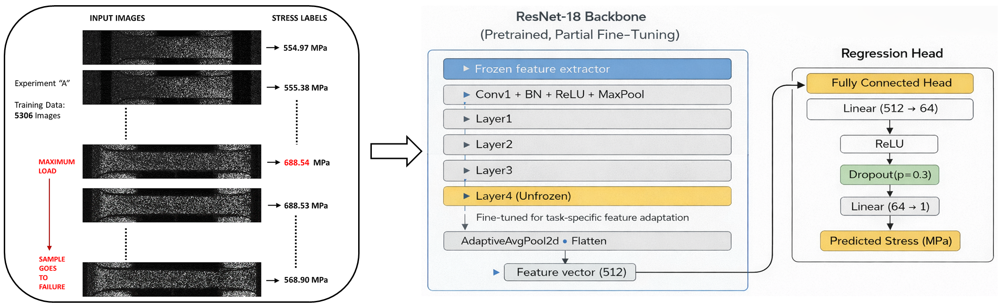
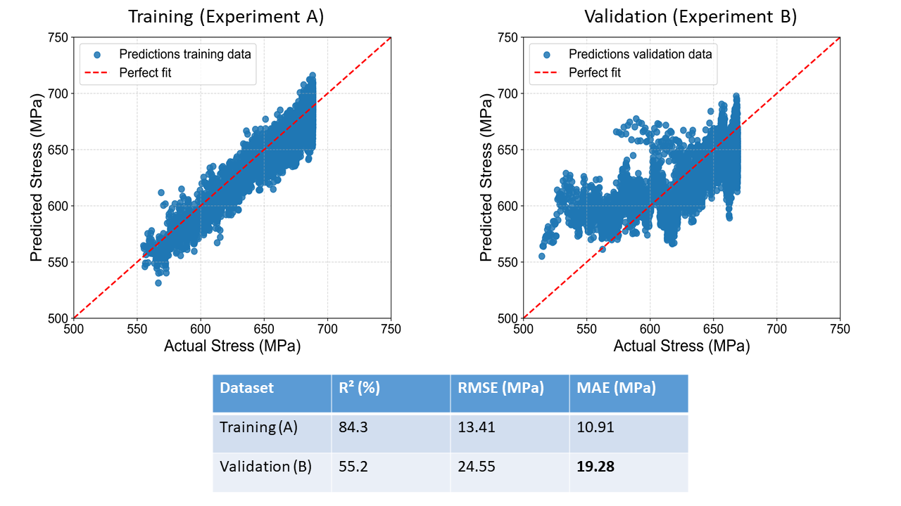

# CNN-Stress-State-Estimation

Implementation of a **Convolutional Neural Networks (CNN)** for stress state estimation from deformed surface images.

This project was presented as a research poster at **PyTorch Conference Europe 2026**, demonstrating the application of deep learning for stress state estimation directly from deformed surface images. The repository provides the official implementation accompanying the presented work.

---

## Data Preparation and Model Overview

Approximately **11,000 surface images** were collected from uniaxial tensile experiments on two independent miniaturized **316L stainless steel** specimens (Experiments A and B). Each image was paired with its corresponding stress value. The CNN was trained using **Experiment A** and evaluated on the independent **Experiment B** to assess its generalization capability.

The proposed model is based on a pretrained **ResNet18** with transfer learning and selective fine-tuning. A regression head predicts continuous stress values, while the **Huber loss** is used for robust training.

  

---

## Results

The model captures the stress evolution in the training data and achieves an **MAE** of approximately **20 MPa** on an independent experiment, which is **acceptable for engineering applications**. These results show that stress can be inferred directly from surface images, enabling early insight before visible damage appears.

  

---

## Implementation

The repository contains the complete implementation of the proposed CNN framework in a single Python script:

**`CNN_Stress.py`**

The code includes the complete workflow, including:

- dataset preparation and preprocessing,
- transfer learning with **ResNet18**,
- model training and selective fine-tuning,
- model evaluation on an independent experiment,
- saving the trained model,
- stress prediction using the trained network.

---

